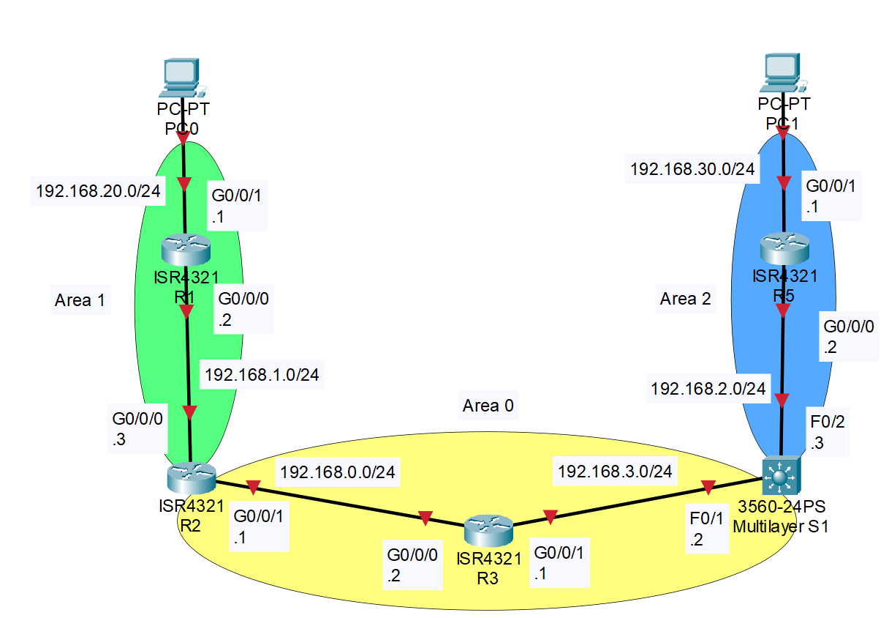
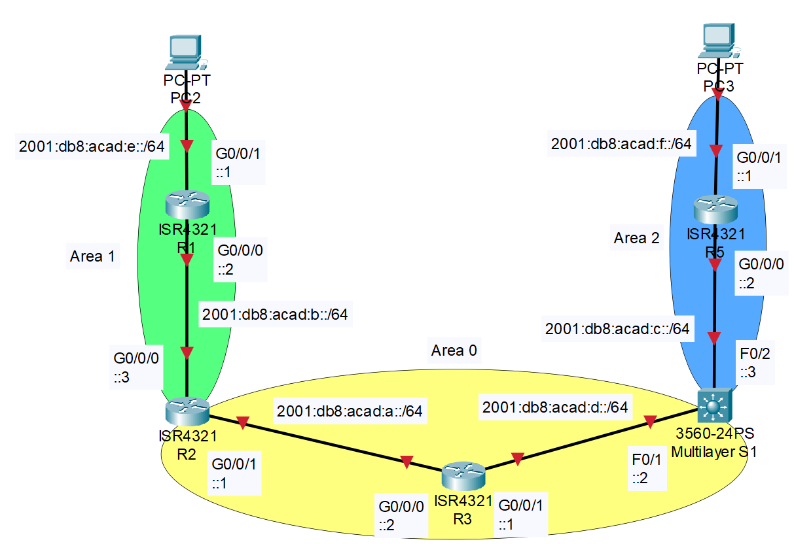

# Multiarea OSPF Configuration with IPv4 & IPv6

## Contents

1. [**Purpose**](#purpose)
2. [**Background**](#background)
     1. [**Open Shortest Path First (OSPF)**](#open-shortest-path-first-ospf)
     2. [**MultiLayer Swithches**](#multilayer-switches)
3. [**Topology**](#topology)
     1. [**IPv4 Topology**](#ipv4-topology)
     2. [**IPv6 Topology**](#ipv6-topology)
4. [**Address Table**](#address-table)
5. [**Device Overview**](#device-overview)
6. [**ICMPv4 Ping Across Network**](#icmpv4-ping-across-network)
7. [**ICMPv6 Ping Across Network**](#icmpv6-ping-across-network)
8. [**IPv4 Routing Table**](#ipv4-topology)
9. [**IPv6 Routing Table**](#ipv6-topology)

## Purpose

This lab's purpose is to create a multiarea OSPF network with at least 3 areas, 2 routers in each area, and one multilayer switch between 2 areas. This lab requires knowledge on how to create subnets for networks, advertise interfaces for OSPF, and connect links between devices. Additionally the ability to write network statements using wildcard masks is also needed.\
This lab is a demonstration of using multiarea OSPF, which is a common networking scheme. Although this specific topology lacks the redundancy that a network should have, it is just used to demonstrate the basic configuration of multiarea OSPF..

## Background

This is section is background info on key concept/parts of the configuration. It is directed an audience that knows some networking, but their knowledge is limited.

### Open Shortest Path First (OSPF)

When a PC tries to send a packet of information to a destination on the internet, if a router doesn’t know where to send that packet the router will kill it. The first and easy solution to this problem would be to manually enter in which way a router should send a packet based on the destination address. But this causes another problem: the number of hours of labor to manually enter in each destination on each router would be many. Here’s where **Open Shortest Path First (OSPF)** comes in to help.\
OSPF is a routing protocol that gathers data on where routers are and the network addresses between routers. This allows OSPF to make a topology of the network, which enables OSPF to create a table of routes to each network. This makes it easier for routes to be set up because all a router needs to do to receive these routes is to advertise its own addresses to take part in OSPF.

### Multilayer Switches

A multilayer switch is a switch that can also be used as a router. There isn’t much of a difference between a multilayer switch and a router, except the fact that a multilayer switch can also send data on a layer 2 network. In short, a multilayer switch has both the functions of a switch and a router.

## Topology

These are the topologies for both IPv4 and IPv6, each link is labeled with the network number and subnet mask of the link. Then each interface is labeled with the 4th octet of the usable IP address within the subnet of that link.\
Additionally, the PCs can have any IP that is within the subnet of the link that they are on. **DHCP is not setup**.

### <center>IPv4 Topology</center>



### <center>IPv6 Topology</center>



## Address Table

|Device Name|Interface|IPv6 Address         |IPv4 Address|IPv4 Subnet Mask|
|:----------|:--------|:--------------------|:-----------|:--------------:|
|R1         |G0/0/0   |2001:db8:acad:b::2/64|192.168.1.2 |255.255.255.0   |
|R1         |G0/0/1   |2001:db8:acad:e::1/64|192.168.20.1|255.255.255.0   |
|R2         |G0/0/0   |2001:db8:acad:b::3/64|192.168.1.3 |255.255.255.0   |
|R2         |G0/0/1   |2001:db8:acad:a::1/64|192.168.0.1 |255.255.255.0   |
|R3         |G0/0/0   |2001:db8:acad:a::2/64|192.168.0.2 |255.255.255.0   |
|R3         |G0/0/1   |2001:db8:acad:d::1/64|192.168.3.1 |255.255.255.0   |
|R5         |G0/0/0   |2001:db8:acad:c::2/64|192.168.2.2 |255.255.255.0   |
|R5         |G0/0/1   |2001:db8:acad:f::10/64|192.168.30.1|255.255.255.0   |
|S1         |F0/1     |2001:db8:acad:d::2/64|192.168.3.2 |255.255.255.0   |
|S1         |F0/2     |2001:db8:acad:c::3/64|192.168.2.3 |255.255.255.0   |

## Device Overview

This Topology Consists of...

- Five 4321 routers running Cisco IOS XE Software, Version 16.9 Universal K9
- One Cisco 3560 POE-38 running C3560-IPSERVICESK9-M Version 12.2(44)SE5

## ICMPv4 Ping Across Network

```text
C:\>ping 192.168.30.10

Pinging 192.168.30.10 with 32 bytes of data:

Reply from 192.168.30.10: bytes=32 time<1ms TTL=255
Reply from 192.168.30.10: bytes=32 time<1ms TTL=255
Reply from 192.168.30.10: bytes=32 time<1ms TTL=255
Reply from 192.168.30.10: bytes=32 time<1ms TTL=255

Ping statistics for 192.168.30.10:
    Packets: Sent = 4, Received = 4, Lost = 0 (0% loss),
Approximate round trip times in milli-seconds:
    Minimum = 0ms, Maximum = 0ms, Average = 0ms
```

## ICMPv6 Ping Across Network

```text
C:\>ping 2001:db8:acad:f::10

Pinging 2001:db8:acad:f::10 with 32 bytes of data:

Reply from 2001:DB8:ACAD:F::10: bytes=32 time<1ms TTL=255
Reply from 2001:DB8:ACAD:F::10: bytes=32 time<1ms TTL=255
Reply from 2001:DB8:ACAD:F::10: bytes=32 time<1ms TTL=255
Reply from 2001:DB8:ACAD:F::10: bytes=32 time<1ms TTL=255

Ping statistics for 2001:DB8:ACAD:F::10:
    Packets: Sent = 4, Received = 4, Lost = 0 (0% loss),
Approximate round trip times in milli-seconds:
    Minimum = 0ms, Maximum = 0ms, Average = 0ms
```

## R1 IPv4 Routing Table

```text
R1#show ip route
Codes: L - local, C - connected, S - static, R - RIP, M - mobile, B - BGP
       D - EIGRP, EX - EIGRP external, O - OSPF, IA - OSPF inter area
       N1 - OSPF NSSA external type 1, N2 - OSPF NSSA external type 2
       E1 - OSPF external type 1, E2 - OSPF external type 2
       i - IS-IS, su - IS-IS summary, L1 - IS-IS level-1, L2 - IS-IS level-2
       ia - IS-IS inter area, * - candidate default, U - per-user static route
       o - ODR, P - periodic downloaded static route, H - NHRP, l - LISP
       a - application route
       + - replicated route, % - next hop override, p - overrides from PfR

Gateway of last resort is not set

O IA  192.168.0.0/24 [110/2] via 192.168.1.3, 00:03:22, GigabitEthernet0/0/0
      192.168.1.0/24 is variably subnetted, 2 subnets, 2 masks
C        192.168.1.0/24 is directly connected, GigabitEthernet0/0/0
L        192.168.1.2/32 is directly connected, GigabitEthernet0/0/0
O IA  192.168.2.0/24 [110/4] via 192.168.1.3, 00:03:10, GigabitEthernet0/0/0
O IA  192.168.3.0/24 [110/3] via 192.168.1.3, 00:03:22, GigabitEthernet0/0/0
      192.168.20.0/24 is variably subnetted, 2 subnets, 2 masks
C        192.168.20.0/24 is directly connected, GigabitEthernet0/0/1
L        192.168.20.1/32 is directly connected, GigabitEthernet0/0/1
O IA  192.168.30.0/24 [110/5] via 192.168.1.3, 00:03:10, GigabitEthernet0/0/0
```

## R1 IPv6 Routing Table

```text
R1#show ipv6 route
IPv6 Routing Table - default - 9 entries
Codes: C - Connected, L - Local, S - Static, U - Per-user Static route
       B - BGP, R - RIP, I1 - ISIS L1, I2 - ISIS L2
       IA - ISIS interarea, IS - ISIS summary, D - EIGRP, EX - EIGRP external
       ND - ND Default, NDp - ND Prefix, DCE - Destination, NDr - Redirect
       O - OSPF Intra, OI - OSPF Inter, OE1 - OSPF ext 1, OE2 - OSPF ext 2
       ON1 - OSPF NSSA ext 1, ON2 - OSPF NSSA ext 2, a - Application
OI  2001:DB8:ACAD:A::/64 [110/2]
     via FE80::CE7F:76FF:FE6A:B5E0, GigabitEthernet0/0/0
C   2001:DB8:ACAD:B::/64 [0/0]
     via GigabitEthernet0/0/0, directly connected
L   2001:DB8:ACAD:B::2/128 [0/0]
     via GigabitEthernet0/0/0, receive
OI  2001:DB8:ACAD:C::/64 [110/4]
     via FE80::CE7F:76FF:FE6A:B5E0, GigabitEthernet0/0/0
OI  2001:DB8:ACAD:D::/64 [110/3]
     via FE80::CE7F:76FF:FE6A:B5E0, GigabitEthernet0/0/0
C   2001:DB8:ACAD:E::/64 [0/0]
     via GigabitEthernet0/0/1, directly connected
L   2001:DB8:ACAD:E::1/128 [0/0]
     via GigabitEthernet0/0/1, receive
OI  2001:DB8:ACAD:F::/64 [110/5]
     via FE80::CE7F:76FF:FE6A:B5E0, GigabitEthernet0/0/0
L   FF00::/8 [0/0]
     via Null0, receive
```
